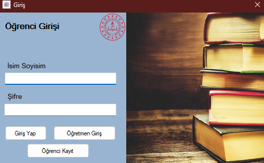
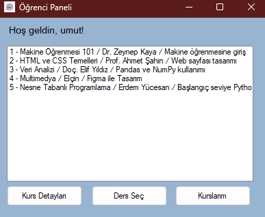
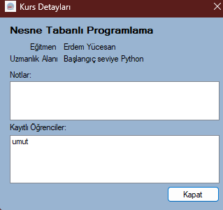
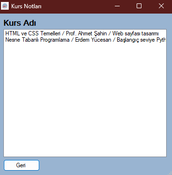
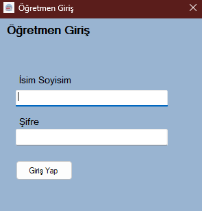
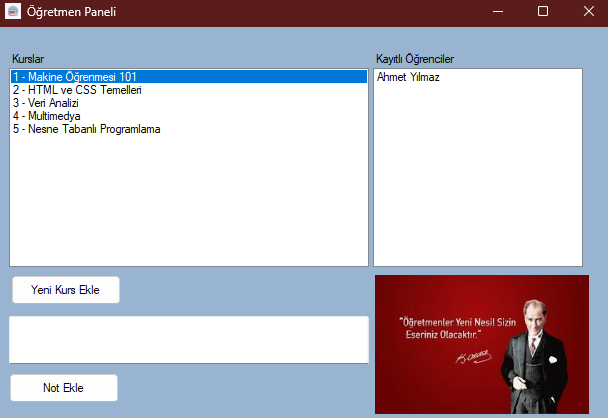

# 🎓 Online Eğitim Platformu

Bu proje, **C#** kullanılarak geliştirilen bir **Online Eğitim Platformu** uygulamasıdır. Öğrenci ve öğretmen rolleri için ayrı paneller içerir ve kullanıcıların kurslara erişmesini, kurs detaylarını görüntülemesini ve içeriklerle etkileşim kurmasını sağlar.

---

## 🚀 Kurulum ve Başlatma

Projeyi çalıştırmak için aşağıdaki adımları takip edin:

1. **Veritabanını Restore Edin:**
   - Proje klasöründe bulunan `OnlineEgitim.bak` dosyasını kendi **SQL Server** ortamınıza restore edin.

2. **Sunucu Ayarlarını Güncelleyin:**
   - `Databasehelper.cs` dosyasını açın.
   - `SqlConnection` bağlantı cümlesindeki **sunucu adını** kendi bilgisayarınıza uygun şekilde güncelleyin.

3. **Visual Studio'da Projeyi Başlatın:**
   - Çözümü Visual Studio ile açın ve projeyi çalıştırın.

---

## 👨‍🎓 Öğrenci Özellikleri

- Yeni hesap oluşturma
- Sisteme giriş yapma
- Aktif kursları görüntüleme
- Kurslara katılma
- Kurs detaylarını görme
- Katıldığı kursları listeleme

### 📸 Ekran Görüntüleri (Öğrenci)

- **Giriş Ekranı:**  
  

- **Öğrenci Paneli:**  
  

- **Kurs Detayları:**  
  

- **Kurslarım:**  
  

---

## 👨‍🏫 Öğretmen Özellikleri

- Giriş yapma
- Yeni kurs ekleme
- Kurslara not ekleme
- Kursuna katılan öğrencileri listeleme

### 📸 Ekran Görüntüleri (Öğretmen)

- **Giriş Ekranı:**  
  

- **Öğretmen Paneli:**  
  

---

## 🛠️ Kullanılan Teknolojiler

- C# (.NET Framework)
- Windows Forms
- SQL Server (Veritabanı)
- ADO.NET (Veri erişimi)

---

## 📬 İletişim

Herhangi bir soru veya katkı için iletişime geçmekten çekinmeyin!

---

**Not:** Bu proje bir eğitim amaçlı çalışmadır ve daha ileri düzey özelliklerle geliştirilmeye açıktır.
